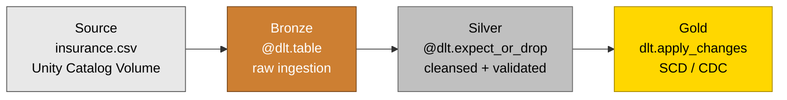

# Insurance DLT Pipeline

> 🚧 **Status:** Actively in development — Bronze and Silver DLT layers complete (May 2026). Gold layer with apply_changes (CDC) in progress.

End-to-end declarative Lakehouse pipeline using Delta Live Tables on Azure Databricks — insurance domain.

---

## Author

**Kumari Shishubala**
*Data Engineer | Databricks Certified Professional | London, UK*

🔗 [LinkedIn](https://linkedin.com/in/kumari-shishubala-b01b8b253)

---

## Architecture

This pipeline differs from an **imperative** PySpark pipeline because Delta Live Tables manages
orchestration, the dependency graph between tables, automatic retries on failure, and
incremental refresh — all derived from the declarative `@dlt.table` definitions. Instead of
writing a driver notebook that calls `read → transform → write` step-by-step, you describe
*what* each table should be, and DLT figures out *how and when* to materialise it.

---

## Why DLT?

- **Declarative authoring** — describe the target table; DLT plans the execution.
- **Native data quality expectations** with three enforcement tiers: `expect` (warn),
  `expect_or_drop` (drop bad rows), `expect_or_fail` (fail the pipeline).
- **Built-in lineage and observability** — table-level lineage, event log, and run metrics
  available out of the box, surfaced in the DLT UI and Unity Catalog.
- **Native CDC** via `dlt.apply_changes` — Type 1 / Type 2 SCD without hand-rolling MERGE logic.

---

## Business Insights Surfaced

- Risk-stratified pricing visible at the Silver level: high-risk band (60+ AND smoker, n=27) averages £40,630; medium (60+ OR smoker, n=334) averages £26,975.99; low (n=977) averages £7,828.88 — a 5.2× spread driven by the derived risk_band column.
- Source data quality: 0 negative charges, 0 invalid ages, 0 invalid children counts in the Kaggle dataset — confirming Kaggle's data curation. Five rows triggered the plausible_bmi warning (BMI outside the 10-60 range), retained for analysis rather than dropped.
- Region distribution intact: all 1,338 rows have one of the four valid regions, confirming the @dlt.expect_or_fail invariant on region_present.

---

## Tech Stack

- **Azure Databricks** — managed runtime
- **Delta Live Tables (DLT / Lakeflow)** — declarative pipeline framework
- **Delta Lake** — ACID storage layer
- **PySpark** — transformation engine
- **Unity Catalog** — governance, lineage, Volumes for source files
- **Python 3.11**

---

## Project Status

| Layer  | Status         | Description                                                                                                                                                                                                       | Date     |
|--------|----------------|-------------------------------------------------------------------------------------------------------------------------------------------------------------------------------------------------------------------|----------|
| Bronze | ✅ Complete     | DLT `@dlt.table` with Auto Loader (`cloudFiles`) ingestion. Three audit columns: `_ingestion_timestamp`, `_source_file` (UC-compliant via `_metadata.file_path`), `_source_system`. Runs as Lakeflow declarative pipeline. | May 2026 |
| Silver | ✅ Complete | DLT @dlt.expect three-tier expectations (warn/drop/fail). Five rules: plausible_bmi (warn), non_negative_charges + valid_age + valid_children_count (drop), region_present (fail). Light enrichment: risk_band derived from age + smoker. _silver_processed_timestamp audit column. | May 2026 |
| Gold   | ⏳ Planned      | CDC via `dlt.apply_changes` (SCD Type 2).                                                                                                                                                                          | —        |

Supporting work:
- [x] Repo skeleton and project scaffolding
- [ ] Unit tests (`pytest`) for transformation helpers
- [ ] CI workflow (lint + tests)

---

## Recent updates

- **May 2026:** Completed Silver DLT layer with three-tier expectations. Of 1,338 Bronze rows, 1,338 reached Silver (clean data — 0 drops, 5 plausible_bmi warnings, 0 fails). Surfaced first business insight: high-risk insureds (60+ smokers) average £40,630 in charges versus £7,828 for low-risk — a 5.2× pricing signal stratified by the derived risk_band column.
- **May 2026:** Completed Bronze DLT layer. Auto Loader ingestion of Kaggle insurance dataset (1,338 rows) into `workspace.default.bronze_insurance_claims` via declarative `@dlt.table`. Pipeline runs green on Databricks Free Edition with serverless compute in 39 seconds end-to-end.

---

## What this demonstrates

- Declarative **DLT pipelines** instead of imperative Spark jobs
- Three-tier **data quality expectations** (`expect` / `expect_or_drop` / `expect_or_fail`)
- **Change Data Capture** using `dlt.apply_changes` for SCD handling
- **Unity Catalog** integration (Volumes for source data, three-level namespacing for tables)
- **Dependency graph auto-resolution** — DLT infers table order from references

---

## Related Project

See also: **NYC Taxi Medallion Pipeline** (imperative PySpark) — [github.com/Shishubala-01/nyc-taxi-medallion-pipeline](https://github.com/Shishubala-01/nyc-taxi-medallion-pipeline)

---

## Lessons Learned

- **Unity Catalog migration:** `input_file_name()` is deprecated in UC-governed workspaces. The replacement is `_metadata.file_path`, which is a hidden struct column providing structured access to source-file attributes (path, size, modification time). A small but real migration step when moving from Hive metastore to Unity Catalog.
- **DLT expect tiers — observability vs action:** `@dlt.expect` (warn) tracks counts but doesn't filter or modify rows; bad rows still flow through to the output. To surface WHICH rows failed a warn rule, you need a parallel `@dlt.view` that filters to the failing rows or a quality flag column. `@dlt.expect_or_drop` filters; `@dlt.expect_or_fail` aborts the whole pipeline if any row fails — useful for invariants like null primary keys, but a single bad row kills the run, so use sparingly.

---

## Contact

📧 [kshishubala051@gmail.com](mailto:kshishubala051@gmail.com)
🔗 [linkedin.com/in/kumari-shishubala-b01b8b253](https://linkedin.com/in/kumari-shishubala-b01b8b253)
